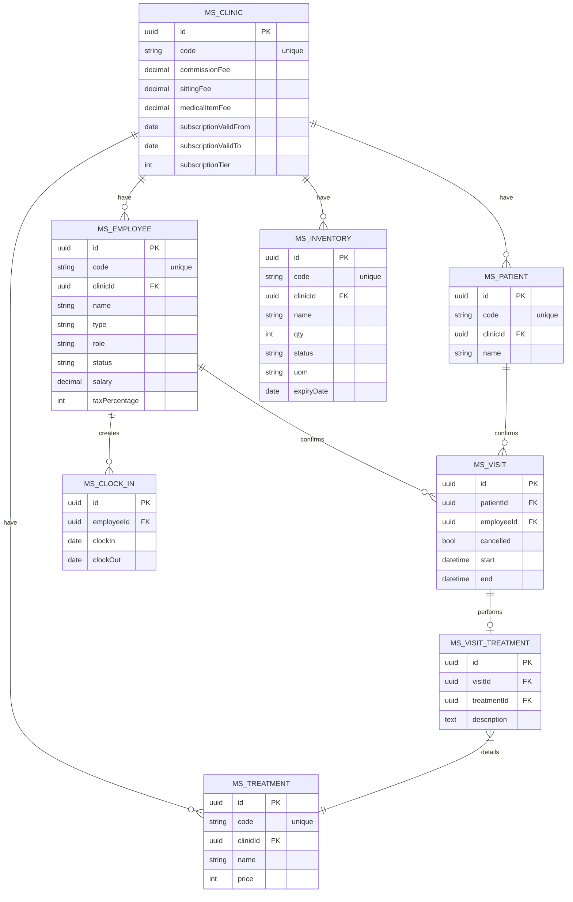

```mermaid
erDiagram
    MS_CLINIC ||--o{ MS_EMPLOYEE : have
    MS_CLINIC ||--o{ MS_PATIENT : have
    MS_CLINIC ||--o{ MS_TREATMENT : have
    MS_CLINIC ||--o{ MS_INVENTORY : have
    MS_EMPLOYEE ||--o{ MS_VISIT : confirms
    MS_EMPLOYEE ||--o{ MS_CLOCK_IN : creates
    MS_PATIENT ||--o{ MS_VISIT : confirms
    MS_VISIT ||--o| MS_VISIT_TREATMENT : performs
    MS_VISIT_TREATMENT }|--|| MS_TREATMENT : details
    
    MS_CLINIC { 
        uuid id PK
        string code "unique" 
        decimal commissionFee 
        decimal sittingFee
        decimal medicalItemFee
        date subscriptionValidFrom
        date subscriptionValidTo
        int subscriptionTier
    }
    MS_EMPLOYEE {
        uuid id PK
        string code "unique"
        uuid clinicId FK
        string name
        string type
        string role
        string status
        decimal salary
        int taxPercentage
    }
    MS_PATIENT {
        uuid id PK
        string code "unique"
        uuid clinicId FK
        string name   
    }
    MS_VISIT {
        uuid id PK
        uuid patientId FK
        uuid employeeId FK
        bool cancelled
        datetime start
        datetime end 
    }
    MS_CLOCK_IN {
        uuid id PK
        uuid employeeId FK
        date clockIn
        date clockOut
    }
    MS_TREATMENT {
        uuid id PK
        string code "unique"
        uuid clinidId FK
        string name 
        int price
    }
    MS_INVENTORY {
        uuid id PK 
        string code "unique"
        uuid clinicId FK
        string name
        int qty
        string status
        string uom
        date expiryDate
    }
    MS_VISIT_TREATMENT {
        uuid id PK
        uuid visitId FK
        uuid treatmentId FK
        text description
    }
```
