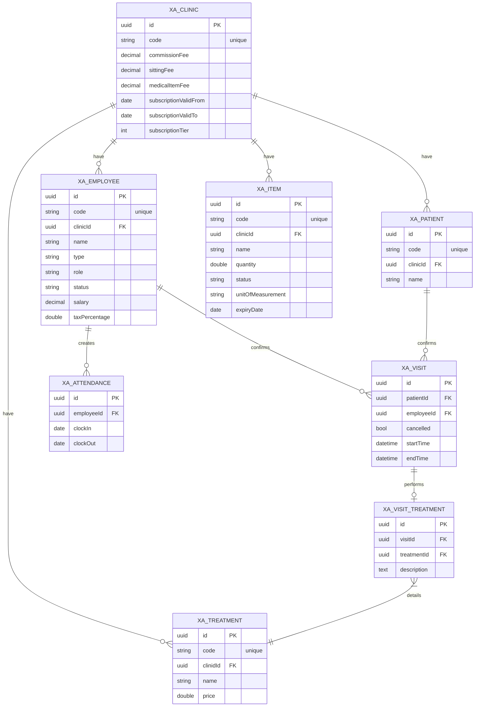

```mermaid
erDiagram
    XA_CLINIC ||--o{ XA_EMPLOYEE : have
    XA_CLINIC ||--o{ XA_PATIENT : have
    XA_CLINIC ||--o{ XA_TREATMENT : have
    XA_CLINIC ||--o{ XA_ITEM : have
    XA_EMPLOYEE ||--o{ XA_VISIT : confirms
    XA_EMPLOYEE ||--o{ XA_ATTENDANCE : creates
    XA_PATIENT ||--o{ XA_VISIT : confirms
    XA_VISIT ||--o| XA_VISIT_TREATMENT : performs
    XA_VISIT_TREATMENT }|--|| XA_TREATMENT : details
    
    XA_CLINIC { 
        uuid id PK
        string code "unique" 
        decimal commissionFee 
        decimal sittingFee
        decimal medicalItemFee
        date subscriptionValidFrom
        date subscriptionValidTo
        int subscriptionTier
    }
    XA_EMPLOYEE {
        uuid id PK
        string code "unique"
        uuid clinicId FK
        string name
        string type
        string role
        string status
        decimal salary
        double taxPercentage
    }
    XA_PATIENT {
        uuid id PK
        string code "unique"
        uuid clinicId FK
        string name   
    }
    XA_VISIT {
        uuid id PK
        uuid patientId FK
        uuid employeeId FK
        bool cancelled
        datetime startTime
        datetime endTime 
    }
    XA_ATTENDANCE {
        uuid id PK
        uuid employeeId FK
        date clockIn
        date clockOut
    }
    XA_TREATMENT {
        uuid id PK
        string code "unique"
        uuid clinidId FK
        string name 
        double price
    }
    XA_ITEM {
        uuid id PK 
        string code "unique"
        uuid clinicId FK
        string name
        double quantity
        string status
        string unitOfMeasurement
        date expiryDate
    }
    XA_VISIT_TREATMENT {
        uuid id PK
        uuid visitId FK
        uuid treatmentId FK
        text description
    }
```
