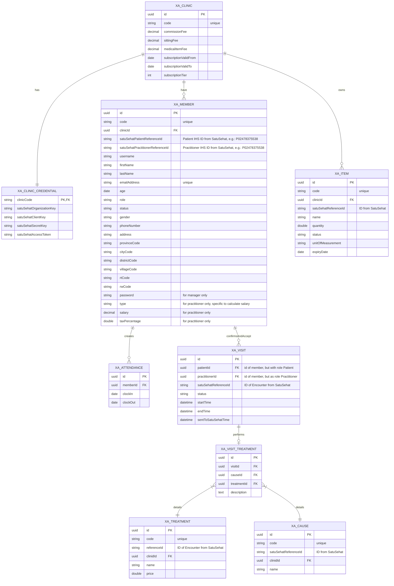

### Overview 
For every entities placed below, there are auditing columns. This will be used to make sure "who" and "when" 
are the corresponding columns created and last changed. These columns are:
- timestamp createdDate
- string createdBy
- timestamp lastUpdatedDate
- string lastUpdatedBy
   

