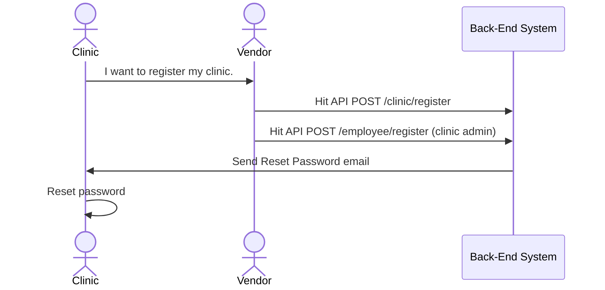

## Overview
These diagrams will show the flow of interactions between users / system / SatuSehat, etc.

### 1. Clinic Creation Flow
This flow describes how a clinic can subscribe to our system.

   

### 2. Employee Creation Flow
While there will be an employee is automatically created during "1. Clinic Creation Flow",
A clinic might want to add another employee or add a doctor. This flow will show how to perform it.

```mermaid
sequenceDiagram
    actor C1 as Clinic Admin 1
    participant UIS as UI System 
    participant BES as Back-End System 
    participant SS as SatuSehat
    
    note right of C1: Login section
    rect rgb(5, 5, 5)
        C1 ->> UIS: Login using "Username"
        UIS ->> BES: Hit API /public/login
        BES ->> UIS: Set Session ID
        UIS ->> C1: Redirect to Dashboard
        C1 ->> UIS: Go to "Employee Registration"
    end

    %% DEPRECATED FLOW
    %% alt chooses empoloyee type "DOCTOR"
    %%    UIS ->> UIS: Show input field to Search By NIK
    %%    C1 ->> UIS: User inputs NIK
    %%    UIS ->> BES: Send the user inputs & click submit
    %%    BES ->> SS: Hit API search practitioner by NIK
    %%    BES ->> UIS: Return founded user from SatuSehat
    %%    C1 ->> UIS: Click Submit
    alt chooses employee type "CLINIC_ADMIN"
        UIS ->> UIS: Show all necessary input fields
        C1 ->> UIS: User input all fields & click submit
        UIS ->> BES: Send input to Backend
        BES ->> BES: Save all data to POST employee/register
        
        create actor C2 as Clinic Admin 2
            BES ->> C2: Data send successfully and send Reset Password email
        destroy C2
    end
```

   

### 3. Visit Creation Flow
This flow describes how to make a visit between a practitioner and a doctor

```mermaid
sequenceDiagram
    actor C as Clinic Admin
    participant UIS as UI System 
    participant BES as Back-End System 
    participant SS as SatuSehat
    
    note right of C: Login section
    rect rgb(5, 5, 5)
        C ->> UIS: Login using "Username"
        UIS ->> BES: Hit API /public/login
        BES ->> UIS: Set Session ID
        UIS ->> C: Redirect to Dashboard
        C ->> UIS: Go to "Visit List"
    end

    alt chooses "Create Visit"
        C ->> UIS: Input practitioner's name 
        UIS ->> BES: GET /practitioner/name
        BES ->> SS: Fetch practitioner by name
        SS ->> BES: Return list of practitioners
        BES ->> UIS: Return names of practitioners
        UIS ->> C: Click one of the practitioners available

        C ->> UIS: Input patient's name 
        UIS ->> BES: GET /patient/name
        BES ->> SS: Fetch patient by name
        SS ->> BES: Return list of patients
        BES ->> UIS: Return names of patients
        UIS ->> C: Click one of the patients available
    end
```

   